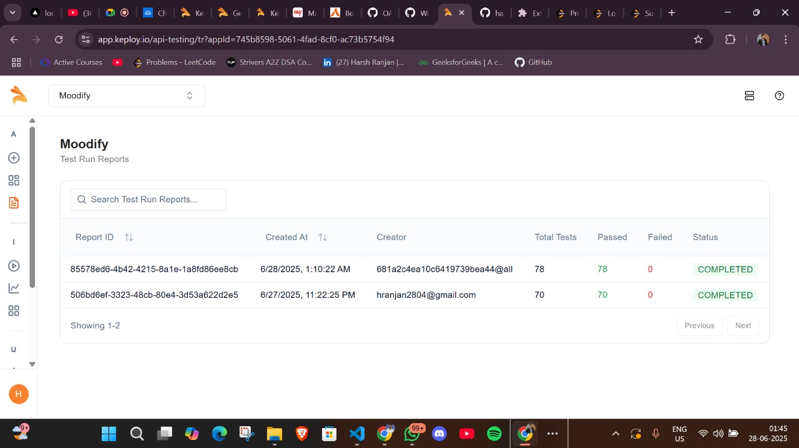

# 🎵 Mood Journal API

_Log your moods, write notes, and get music recommendations based on your mood using the Spotify API._

---

---

## ✨ Features

- 📝 Add, view, edit, and delete mood entries
- 🎧 Get music recommendations for each mood (Spotify integration)
- 📊 View mood statistics
- 💻 Modern React frontend with Tailwind CSS
- 🗄️ RESTful Express backend with MongoDB
- 📑 [API documentation on Postman](https://documenter.getpostman.com/view/44748007/2sB2xBDADR)

---

## 🛠️ Tech Stack

| Frontend         | Backend                     | Database     | API           |
|------------------|----------------------------|--------------|---------------|
| React, Tailwind  | Node.js, Express, Mongoose | MongoDB      | Spotify Web API|

---

## 🚀 Getting Started

### 1. Clone the Repository

git clone https://github.com/harshranjan2804/mood-journal-api.git
cd mood-journal-api

text

### 2. Backend Setup

cd backend
npm install

text

Create a `.env` file:
PORT=8000
MONGO_URI=mongodb://localhost:27017/moodjournal
SPOTIFY_CLIENT_ID=your_spotify_client_id
SPOTIFY_CLIENT_SECRET=your_spotify_client_secret

text

Start MongoDB and the backend server:
mongod
node server.js

text

### 3. Frontend Setup

cd frontend
npm install
npm start

text

---

## 📚 API Documentation

All API endpoints, sample requests, and responses are documented here:  
👉 **[Mood Journal API – Postman Docs](https://documenter.getpostman.com/view/44748007/2sB2xBDADR)**

---

## 🗂️ Main API Endpoints

| Endpoint                  | Method | Description                   |
|---------------------------|--------|-------------------------------|
| `/api/moods`              | POST   | Create a new mood entry       |
| `/api/moods`              | GET    | Get all mood entries          |
| `/api/moods/:id`          | PUT    | Update a mood entry           |
| `/api/moods/:id`          | DELETE | Delete a mood entry           |
| `/api/moods/stats`        | GET    | Get mood statistics           |
| `/api/moods/:id/music`    | GET    | Get music recommendations     |

---

## 💡 Example Usage

**Add a Mood Entry**
POST /api/moods
Content-Type: application/json

{
"mood": "happy",
"note": "Had a great day!"
}

text

**Get Music Recommendations**
GET /api/moods/<MOOD_ID>/music

text

---

## 🧪 Testing and Quality Assurance

Comprehensive automated testing ensures reliability and maintainability.

**Highlights:**
- 🧩 Unit, integration, and API tests
- 🛡️ In-memory MongoDB for isolated tests
- 🎵 Mocked Spotify API for fast, deterministic runs
- 📈 **Coverage:**  
  - Statements: 93.61%  
  - Branches: 80.76%  
  - Functions: 91.17%  
  - Lines: 93.47%
- 🔄 Automated test coverage reports

### Run Tests

npm run test:coverage

text

---

## 🤖 Keploy AI-Powered API Testing & CI/CD

- 🚦 **Automated test generation** from OpenAPI schema and cURL commands
- 🟢 **CI/CD Integration:** All tests run on every commit via GitHub Actions
- 📝 **Artifact retention** for test reports

**CI/CD Pipeline Status:**  

| Test Run | Total Tests | Passed | Failed | Status        |
|----------|-------------|--------|--------|--------------|
| Latest   | 78          | 78     | 0      | ✅ COMPLETED  |
| Previous | 70          | 70     | 0      | ✅ COMPLETED  |

[View CI/CD Workflow](.github/workflows/keploy-ci.yml)

---

## 🏆 Key Benefits

- ⚡ Zero-setup, AI-powered testing
- 🤖 Self-healing test suites
- 🔄 Continuous validation for every code change
- 📊 Detailed reporting and regression protection

---

## 📄 License

MIT

---

## 🙏 Credits

- Inspired by open source mood journal projects and the Spotify API.
- API documentation generated with [Postman](https://www.postman.com/).
- AI-powered testing by [Keploy](https://keploy.io/).

---

**Happy journaling! 🎶**